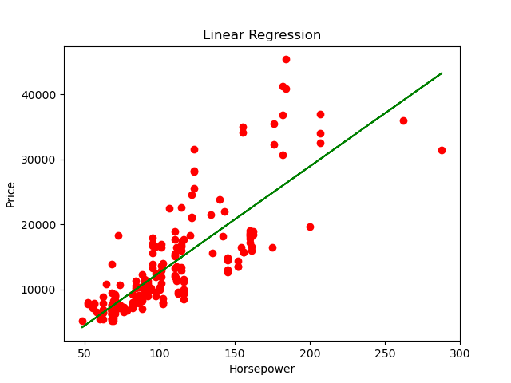
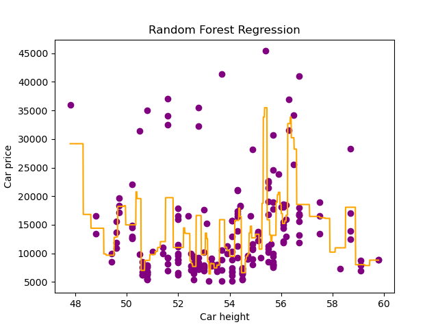

# Araba-Fiyat-Regresyon-Modelleri-Linear-Polynomial-Decision-Tree-and-Random-Forest
Bu proje, araba fiyatlarını tahmin etmek için Linear, Polynomial, Decision Tree ve Random Forest regresyon modellerini kullanır. Beygir gücü, motor boyutu ve diğer araç özelliklerine dayalı fiyat tahminleri yapılmış, modellerin başarımı R2 skoru ile değerlendirilmiştir.

## Proje Açıklaması

Bu proje, araba fiyatlarını tahmin etmek için çeşitli regresyon modellerini kullanmaktadır. Kullanılan modeller şunlardır:

- **Doğrusal Regresyon (Linear Regression)**
- **Çoklu Doğrusal Regresyon (Multiple Linear Regression)**
- **Polinomsal Regresyon (Polynomial Regression)**
- **Karar Ağacı Regresyonu (Decision Tree Regression)**
- **Rastgele Orman Regresyonu (Random Forest Regression)**

Her model, belirli araba özelliklerini kullanarak fiyat tahmini yapmayı amaçlamaktadır. Modellerin performansı **R² (R-Kare) skoru** ile değerlendirilmiştir.

## İçerik

- [Gereksinimler](#gereksinimler)
- [Veri Seti](#veri-seti)
- [Modeller ve Sonuçlar](#modeller-ve-sonuçlar)
  - [Linear Regression](#linear-regression)
  - [Multiple Linear Regression](#multiple-linear-regression)
  - [Polynomial Regression](#polynomial-regression)
  - [Decision Tree Regression](#decision-tree-regression)
  - [Random Forest Regression](#random-forest-regression)
- [Sonuç](#sonuç)

## Gereksinimler

Projeyi çalıştırmak için aşağıdaki Python kütüphanelerine ihtiyacınız vardır:

- `pandas`
- `numpy`
- `scikit-learn`
- `matplotlib`

## Veri Seti

Kullanılan veri seti, **`7_CarPrice_Assignment.csv`** dosyasıdır. Bu veri seti, çeşitli araba özelliklerini ve fiyatlarını içermektedir.

## Modeller ve Sonuçlar

### Linear Regression

- **Amaç:** Beygir gücüne (horsepower) göre araba fiyatını tahmin etmek.
- **R² Skoru:** 0.65

**Grafik:**

### Multiple Linear Regression

- **Amaç:** Araba uzunluğu ve genişliğine göre fiyat tahmini yapmak.
- **R² Skoru:** 0.58

### Polynomial Regression

- **Amaç:** Beygir gücüne göre polinom derecesi artırılarak fiyat tahmini yapmak.
- **Polinom Derecesi:** 3
- **R² Skoru:** 0.67

**Grafik:**

### Decision Tree Regression

- **Amaç:** Motor büyüklüğüne (engine size) göre fiyat tahmini yapmak.
- **R² Skoru:** 0.94

**Grafik:**

### Random Forest Regression

- **Amaç:** Araba yüksekliğine göre fiyat tahmini yapmak.
- **R² Skoru:** 0.46

**Grafik:**

## Sonuç

Bu projede, farklı regresyon modelleri kullanılarak araba fiyatlarının tahmini yapılmıştır. Modellerin performansı R² skorları ile karşılaştırılmıştır. **Decesion Tree Regression**, en yüksek R² skorunu elde ederek en başarılı model olmuştur.
